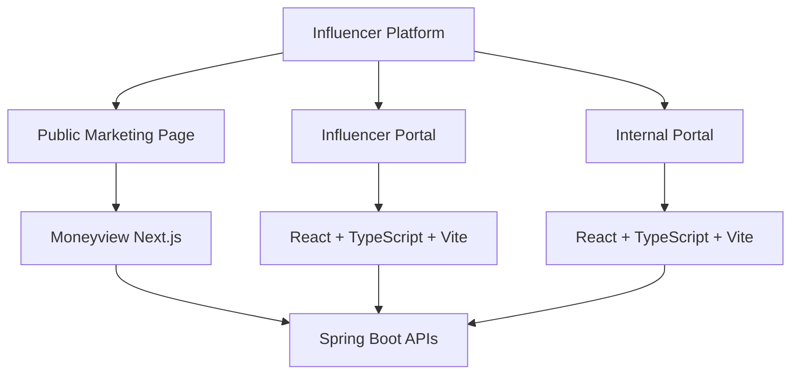
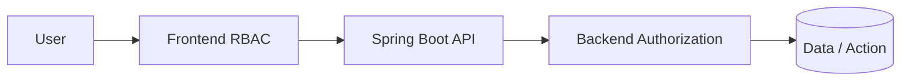
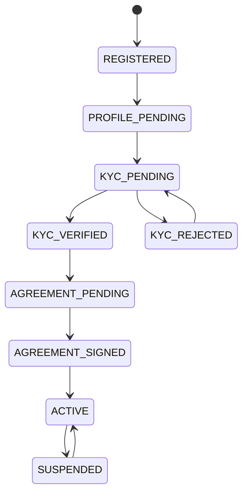
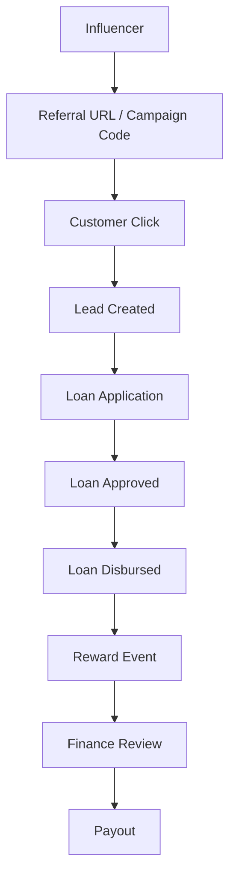
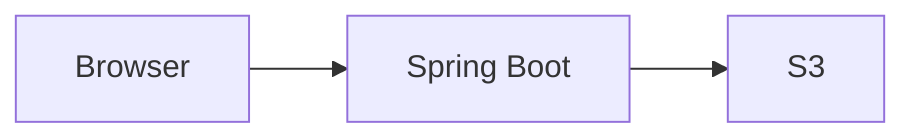
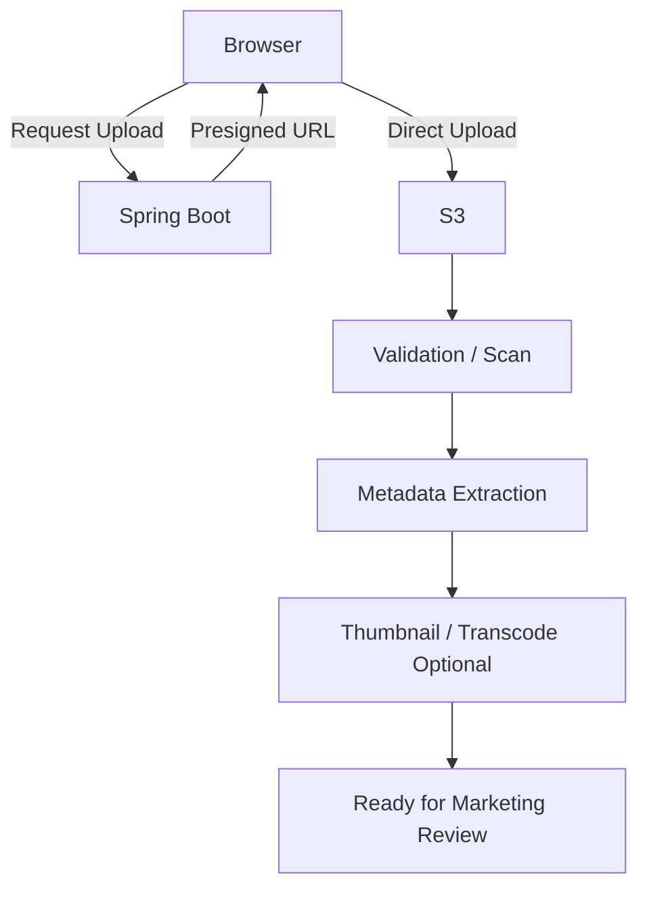
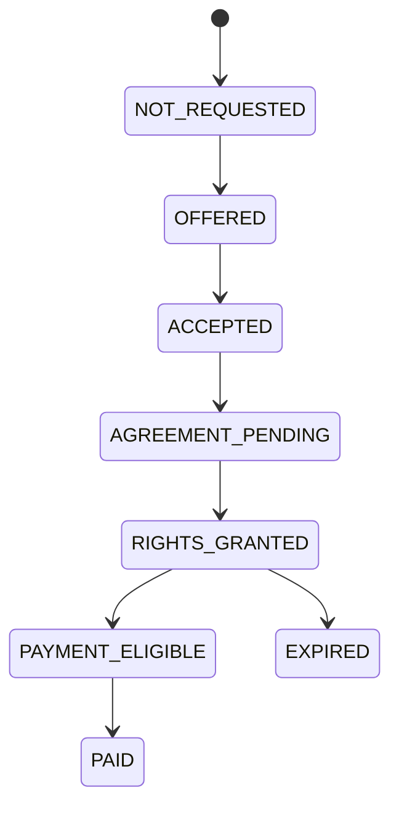
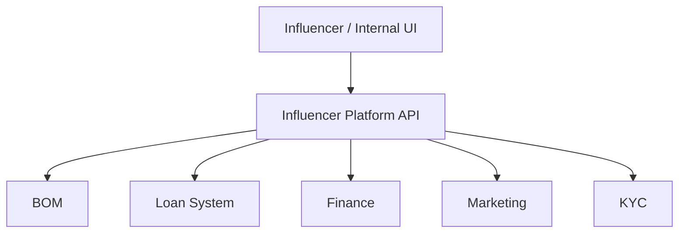
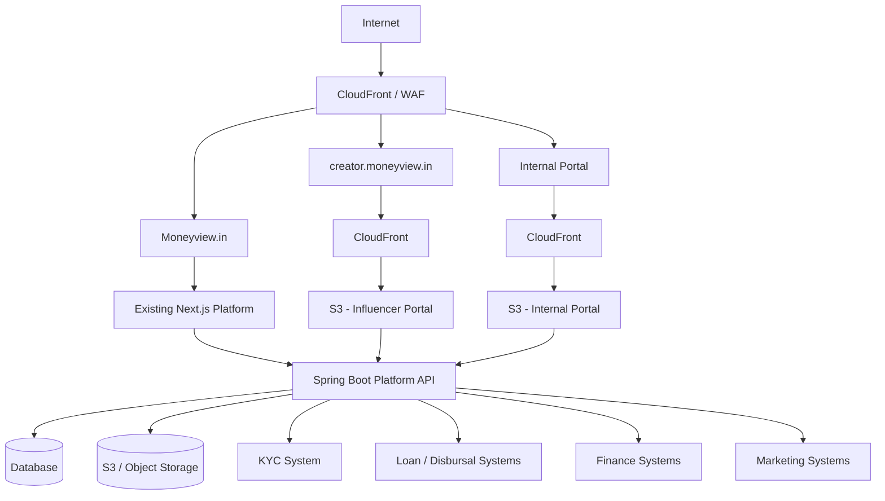

# Moneyview Influencer Platform  
## Frontend Architecture Review & Productionization Recommendation

**Document Purpose:** Architecture review and productionization guidance for the proposed influencer marketing, referral attribution, ad-rights, and payout platform.

**Primary Audience:** Engineering Leadership, Web Engineering, Backend Engineering, Marketing, Finance, Security, Product

**Frontend Stack**
- Existing corporate website: **Next.js**
- Influencer portal: **React + TypeScript + Vite**
- Internal portal: **React + TypeScript + Vite**

**Backend Stack**
- **Java + Spring Boot**

**Target Deployment**
- Corporate marketing page: existing Moneyview Next.js infrastructure
- Influencer portal: S3 + CloudFront
- Internal portal: S3 + CloudFront
- Backend APIs: Spring Boot behind approved API / load-balancing infrastructure

---

# 1. Executive Summary

The current AI-generated repository is valuable as a **working product prototype** because it demonstrates the end-to-end flow across:

- Marketing landing page
- Influencer onboarding
- Authentication
- KYC
- Agreement generation
- Video upload
- Marketing approval
- Referral tracking
- Loan application tracking
- Loan disbursal tracking
- Influencer earnings
- Ad-rights payments
- Internal finance and marketing workflows

However, the prototype should **not automatically become the production architecture**.

The immediate engineering task should be to convert the prototype into clear production boundaries that fit the existing Moneyview ecosystem.

The recommended frontend architecture is:

1. **Public marketing page**
   - Integrate into the existing Moneyview **Next.js application**
   - Keep it under the existing Moneyview domain and production infrastructure

2. **Influencer-facing portal**
   - Keep as an independent **React + TypeScript + Vite SPA**
   - Deploy through **S3 + CloudFront**
   - Design mobile-first

3. **Internal marketing + finance portal**
   - Keep as an independent **React + TypeScript + Vite SPA**
   - Deploy through **S3 + CloudFront**
   - Apply strict role-based authorization

4. **Spring Boot backend**
   - Own domain state, authorization, integrations, attribution, earnings, ledger, and workflow rules
   - Act as the integration boundary between the influencer platform and existing Moneyview systems

The most important architectural principle is:

> The prototype proves the product concept. Productionization should focus on application boundaries, security, state ownership, attribution, payment auditability, and independent deployment rather than simply reviewing generated frontend code line-by-line.

---

# 2. Business Concept

The platform is intended to streamline influencer-led acquisition for Moneyview financial products.

A typical use case is:

1. An influencer joins the Moneyview influencer program
2. Completes onboarding and KYC
3. Signs the required agreement
4. Uploads content or promotional videos
5. Moneyview marketing team reviews and approves the content
6. The influencer receives referral links / campaign attribution
7. Leads generated through the influencer are tracked
8. Loan applications are tracked
9. Successful loan disbursals are attributed
10. The influencer earns a reward for each successful disbursal
11. Finance approves and processes payouts

Current example commercial model:

| Event | Example Reward |
|---|---:|
| Successful Personal Loan disbursal | ₹500 |
| Approved advertising rights for a creator asset | ₹5,000 |

These values should be configurable campaign rules and must not be hard-coded into the frontend or backend.

---

# 3. Product Surfaces

The system should be treated as **three separate frontend products** sharing one business domain.



---

# 4. Public Marketing Page

## Recommendation

The public influencer acquisition page should be implemented inside the existing **Moneyview Next.js platform**.

Possible URLs:

```text
moneyview.in/influencer
moneyview.in/creator-program
moneyview.in/partner-with-us
```

## Why it belongs in the existing Next.js application

The page benefits from the existing Moneyview platform capabilities:

- SEO
- Domain authority
- Existing analytics
- Existing cookie / consent mechanisms
- Existing design system
- Existing header and footer
- Existing CloudFront configuration
- Existing CDN strategy
- Existing monitoring
- Existing experimentation infrastructure
- Existing security and deployment controls
- Existing redirect and routing behavior

## Recommendation for the generated prototype

If the prototype currently contains this page in React/Vite:

**Do not rebuild the design from scratch.**

Instead:

1. Reuse the layout and component structure
2. Adapt components for Next.js
3. Replace prototype routing / APIs with production services
4. Integrate the Moneyview design system
5. Move analytics to the existing Moneyview analytics layer
6. Validate performance and SEO

---

# 5. Influencer-Facing Portal

The influencer portal is a good candidate for:

```text
React + TypeScript + Vite
        ↓
Static Build
        ↓
S3
        ↓
CloudFront
```

Example domain:

```text
creator.moneyview.in
```

## Suggested Information Architecture

```text
/dashboard

/onboarding
  /profile
  /kyc
  /bank-details
  /agreement

/content
  /upload
  /videos
  /video/:id

/referrals
  /leads
  /applications
  /disbursals

/earnings
  /transactions
  /payouts

/profile
/settings
```

## Mobile-First Requirement

Influencers are likely to use the portal predominantly on mobile devices.

Therefore:

> The influencer portal should be designed as **mobile-first and desktop-supported**.

Important UX areas:

- OTP login
- Resume onboarding
- KYC progress
- Upload progress
- Network retry
- Agreement signing
- Referral statistics
- Earnings visibility
- Payment status
- Rejected content feedback
- Mobile video upload
- Empty states
- Session timeout handling

---

# 6. Internal Marketing + Finance Portal

The internal portal can also remain:

```text
React + TypeScript + Vite
        ↓
S3
        ↓
CloudFront
```

The key requirement is proper authorization.

## Marketing Capabilities

```text
Influencer Review
Video Review
Campaign Assignment
Content Approval / Rejection
Ad-Rights Review
Performance Analytics
Creator Status Management
```

## Finance Capabilities

```text
KYC / Payment Information Review
Earnings Review
Payout Approval
Payout Processing
Reconciliation
Finance Reports
Payment History
```

## Admin Capabilities

```text
Campaign Configuration
Reward Configuration
Role Administration
System Configuration
Audit Logs
Master Data
```

---

# 7. RBAC Must Exist in Both Frontend and Backend

Frontend navigation may be role-aware, but hiding a menu is **not authorization**.

Example roles:

```text
MARKETING_REVIEWER
MARKETING_ADMIN

FINANCE_REVIEWER
FINANCE_APPROVER

PLATFORM_ADMIN
```

Recommended model:



Every privileged action must be authorized again on the backend.

---

# 8. Influencer Lifecycle Should Be State-Driven

The frontend should not derive onboarding status from many unrelated fields.

Recommended lifecycle:



## Backend as the source of truth

Example API response:

```json
{
  "influencerStatus": "ACTIVE",
  "nextAction": null,
  "capabilities": [
    "UPLOAD_VIDEO",
    "VIEW_REFERRALS",
    "VIEW_EARNINGS"
  ]
}
```

The frontend should render the appropriate experience from backend state.

---

# 9. Referral Attribution Is the Core Business System

The most difficult part of the product is not displaying ₹500 rewards.

It is proving:

> Influencer X genuinely caused Loan Disbursal Y and is therefore eligible for Reward Z.

Recommended flow:



Questions that must be answered in product and backend specifications:

- What happens when a customer clicks links from two influencers?
- What is the attribution window?
- What happens when an existing Moneyview customer uses a referral?
- How are duplicate phone numbers handled?
- Can an application be attributed after several weeks?
- How are rejected and re-applied loans treated?
- What happens when a disbursal is reversed?
- What happens when suspicious / fraudulent leads appear?
- What happens when the influencer is suspended?
- Can campaign rules change after the lead was generated?
- Which event timestamp determines reward eligibility?

These rules should be part of the system specification before production rollout.

---

# 10. Reward Rules Must Be Configurable

Avoid:

```java
PAYOUT_PER_DISBURSAL = 500;
AD_RIGHT_PAYMENT = 5000;
```

Prefer a campaign model.

Example:

```text
Campaign: Personal Loan Creators - Sep 2026

Product:
Personal Loan

Disbursal Reward:
₹500

Ad-Rights Reward:
₹5,000

Attribution Window:
30 days

Campaign Start:
01 Sep 2026

Campaign End:
30 Sep 2026

Eligibility:
Configured business rules
```

Future rules may vary:

```text
Personal Loan → ₹500
Credit Card → ₹300
Gold Loan → ₹700
Premium Influencer → ₹750
Special Campaign → ₹1,000
```

A campaign / rules engine prevents future rewrites.

---

# 11. Earnings Should Use a Ledger Model

Do not rely on a mutable field such as:

```text
totalEarnings = ₹35,500
```

Use transaction-level records.

## Suggested Ledger Fields

```text
Influencer ID
Campaign ID
Lead ID
Loan/Application ID
Disbursal ID
Event Type
Amount
Currency
Status
Created At
Approved At
Paid At
Payment Reference
Reversal Reference
Audit Metadata
```

Example entries:

| Event | Amount |
|---|---:|
| DISBURSAL_REWARD | +₹500 |
| AD_RIGHT_REWARD | +₹5,000 |
| REVERSAL | -₹500 |
| PAYOUT | -₹8,500 |

Dashboard views can then calculate:

```text
Earned      ₹35,500
Pending      ₹7,000
Approved    ₹28,500
Paid        ₹20,000
Balance      ₹8,500
```

This model is much easier for finance reconciliation and audits.

---

# 12. Video Upload Architecture

Large video files should not be proxied through Spring Boot.

Avoid:



Prefer:



Benefits:

- Lower backend bandwidth
- Better upload reliability
- Easier multipart upload
- Better mobile behavior
- Easier transcoding / moderation integration
- Cleaner scaling model

---

# 13. Video Review Workflow

Recommended status model:

```text
UPLOADED
PROCESSING
READY_FOR_REVIEW
IN_REVIEW
APPROVED
REJECTED
CHANGES_REQUESTED
ARCHIVED
```

Rejections should include structured feedback:

```text
Reason
Reviewer
Comments
Timestamp
Resubmission Allowed
```

---

# 14. Ad-Rights Should Be a Separate Domain Workflow

Ad-rights should not be modeled as:

```text
adRights = true
```

Recommended lifecycle:



Suggested metadata:

```text
Video / Content Asset
Influencer
Platforms Covered
Allowed Usage
Territory
Start Date
End Date
Agreement Version
Rights Status
Payment Amount
Payment Status
```

This enables future questions such as:

- Can Moneyview run this video on Meta?
- Can it be used on YouTube?
- Is usage restricted to six months?
- Does Moneyview own the content?
- Are rights limited to paid advertising?
- Has the usage period expired?

---

# 15. KYC and PII Security Requirements

This platform will process sensitive personal and financial information.

Examples:

```text
Phone Number
PAN
Aadhaar-related information
Bank Information
Address
KYC Documents
Agreement Documents
Signatures
Payment Information
```

Frontend requirements:

- Never store sensitive KYC data in `localStorage`
- Avoid sensitive data in `sessionStorage`
- Never put PII in URLs
- Never put PII in query parameters
- Do not send KYC information to analytics
- Mask values wherever possible
- Use secure session handling
- Use short-lived signed URLs
- Restrict document access
- Prevent caching of sensitive pages
- Implement secure logout
- Implement session expiration
- Use environment-specific analytics configuration
- Ensure frontend logs do not include sensitive payloads

Where possible, store the minimum information required and rely on approved KYC providers / internal services.

---

# 16. Authentication Strategy

## Influencer Portal

Potential pattern:

```text
Phone Number
    ↓
OTP
    ↓
Authenticated Session
```

The implementation should reuse the approved Moneyview authentication mechanism where possible.

## Internal Portal

Prefer the existing enterprise identity layer:

```text
SSO
 ↓
Employee Identity
 ↓
Roles
 ↓
Permissions
```

Do not reuse customer authentication for internal finance / marketing users.

---

# 17. Backend Should Own Integration Complexity

The frontend should not directly know about every internal Moneyview service.

Avoid:

```text
Frontend
 ├── BOM API
 ├── Loan API
 ├── Disbursal API
 ├── CRM API
 ├── Finance API
 └── Campaign API
```

Prefer:



The Spring Boot application becomes the platform-specific integration layer.

Benefits:

- Frontend isolation
- Stable contracts
- Easier testing
- Easier internal system migrations
- Centralized access control
- Reduced coupling

---

# 18. Repository Strategy

A single repository is not inherently bad.

The important requirement is:

> Every product should be independently buildable, testable, deployable, and rollback-able.

A possible monorepo structure:

```text
influencer-platform/

apps/
  influencer-portal/
  influencer-admin/

services/
  influencer-api/

packages/
  ui/
  types/
  api-client/
  validation/
  analytics/
```

The public landing page should likely move into the existing Moneyview website repository:

```text
moneyview-web/
└── influencer / creator-program landing page
```

## Production Recommendation

```text
Moneyview Website Repository
└── Public influencer marketing page

Influencer Platform Repository
├── Influencer portal
├── Internal portal
└── Spring Boot backend
```

---

# 19. CI/CD Independence

A change in one application should not require every application to deploy.

Bad:

```text
Admin UI change
   ↓
Landing page deploy
Influencer portal deploy
Admin portal deploy
Backend deploy
```

Preferred:

```text
Influencer portal change → Influencer portal build/deploy

Admin portal change → Admin portal build/deploy

Backend change → Backend build/deploy

Marketing page change → Existing Moneyview Next.js deployment
```

---

# 20. Recommended Production Deployment Architecture



---

# 21. Frontend Architecture Recommendation

## Preferred Layers

```text
src/
├── app/
├── routes/
├── features/
│   ├── auth/
│   ├── onboarding/
│   ├── kyc/
│   ├── agreements/
│   ├── content/
│   ├── referrals/
│   ├── earnings/
│   └── payouts/
├── components/
├── api/
├── hooks/
├── schemas/
├── types/
├── utils/
└── config/
```

Prefer domain / feature-based structure over large generic folders such as:

```text
components/
pages/
services/
utils/
```

when the application grows.

---

# 22. API State Management

Prefer a centralized server-state approach such as:

```text
React Query / equivalent
        ↓
Typed API Client
        ↓
Spring Boot API
```

Avoid scattered patterns:

```text
useEffect()
fetch()
setLoading()
setError()
setData()
```

across many pages.

Benefits:

- Request caching
- Loading states
- Retry policies
- Error handling
- Refetching
- Mutation state
- Standardized API behavior

---

# 23. Forms

This product has significant form-heavy workflows:

```text
Profile
KYC
Bank Details
Tax Information
Agreements
Video Metadata
Campaign Enrollment
```

Recommended:

```text
Form library
    +
Schema validation
    +
API validation
```

Form state should support:

- Draft / resume
- Validation
- Step navigation
- Server errors
- Reauthentication
- Network failures
- Field masking

---

# 24. Error Handling

Standardize frontend API errors.

Suggested categories:

```text
VALIDATION_ERROR
AUTHENTICATION_REQUIRED
AUTHORIZATION_FAILED
KYC_FAILED
RESOURCE_NOT_FOUND
CONFLICT
UPLOAD_FAILED
RATE_LIMITED
SERVER_ERROR
DEPENDENCY_UNAVAILABLE
```

The UI should provide actionable messaging without leaking internal implementation details.

---

# 25. Observability

Productionization should include frontend and backend observability.

Frontend:

```text
Page Load Performance
JS Errors
Failed API Requests
Upload Failures
Authentication Failures
KYC Funnel
Agreement Funnel
Video Upload Funnel
Referral Dashboard Errors
```

Backend:

```text
API Latency
API Error Rate
Integration Failures
Attribution Failures
Payout Failures
Event Processing
Duplicate Events
KYC Integration
Loan Integration
Finance Integration
```

---

# 26. Auditability

Actions requiring audit trails:

```text
Influencer KYC approval / rejection
Video approval / rejection
Campaign assignment
Ad-rights approval
Reward creation
Reward adjustment
Payout approval
Payout execution
User suspension
Role changes
Configuration changes
```

Suggested audit fields:

```text
Actor
Action
Entity
Previous State
New State
Timestamp
Reason
Request / Correlation ID
```

---

# 27. AI-Generated Repository Review Strategy

Do **not** begin with line-by-line frontend review.

Start with architecture compliance.

Recommended review order:

```text
1. Application boundaries
2. Authentication
3. Authorization
4. API contracts
5. Business-state ownership
6. PII handling
7. Attribution logic
8. Payment / ledger model
9. Error handling
10. Deployment model
11. Observability
12. Frontend state architecture
13. Reusable components
14. Code quality
```

Why?

Reviewing:

```text
useEffect dependencies
component naming
folder naming
CSS conventions
```

has limited value if the system currently contains:

```text
Tokens in localStorage
Frontend-only authorization
Hardcoded payout values
Hardcoded workflow states
Direct coupling to internal APIs
Shared deployments
Sensitive data in browser logs
```

---

# 28. Prototype Classification Exercise

Each part of the generated system should be categorized as:

```text
KEEP
MODIFY
REWRITE
INTEGRATE
REMOVE
```

Example:

| Area | Recommendation |
|---|---|
| Marketing landing page UI | Integrate into existing Next.js |
| Influencer portal design | Keep / modify |
| Internal portal design | Keep / modify |
| Spring Boot service | Review architecture and integrations |
| Authentication | Validate / likely modify |
| Payout constants | Rewrite as configurable rules |
| Referral model | Validate deeply |
| Earnings model | Move to ledger |
| Video upload | Use direct S3 upload |
| RBAC | Validate frontend + backend |
| KYC handling | Security review required |

---

# 29. Suggested Delivery Phases

## Phase 0 — Prototype Assessment

Goals:

```text
Architecture review
Security review
API review
Deployment review
Prototype classification
Production backlog
```

Output:

```text
KEEP / MODIFY / REWRITE / INTEGRATE / REMOVE
```

---

## Phase 1 — Acquisition + Onboarding

Scope:

```text
Moneyview landing page
Phone capture
Authentication
Profile
KYC
Agreement
Basic influencer dashboard
```

Outcome:

> Moneyview can successfully onboard and activate an influencer.

---

## Phase 2 — Content Workflow

Scope:

```text
Video upload
Video processing
Video review
Marketing approval
Rejection / resubmission
Ad-right workflow
```

Outcome:

> Marketing can manage creator content through a structured workflow.

---

## Phase 3 — Referral Attribution

Scope:

```text
Unique referral links
Campaign codes
Lead tracking
Loan application tracking
Disbursal tracking
Attribution rules
Influencer statistics
```

Outcome:

> Moneyview can reliably connect a creator to a disbursed loan.

---

## Phase 4 — Earnings + Finance

Scope:

```text
Reward calculation
Earnings ledger
Finance approval
Payout workflow
Reconciliation
Reports
Audit
```

Outcome:

> Moneyview can accurately calculate, approve, pay, and audit influencer earnings.

---

## Phase 5 — Scale

Possible future capabilities:

```text
Campaign management
Influencer tiers
Performance scoring
Fraud detection
Automated payouts
Notifications
Advanced analytics
Creator segmentation
Content recommendations
Campaign recommendations
```

---

# 30. Frontend Review Checklist

## Application Architecture

- [ ] Clear separation between influencer and internal apps
- [ ] Marketing page planned for Next.js integration
- [ ] Feature-based module boundaries
- [ ] Typed API layer
- [ ] Shared design primitives without excessive coupling
- [ ] Environment configuration validated
- [ ] Independent build and deployment

## TypeScript

- [ ] Strict mode enabled
- [ ] Minimal use of `any`
- [ ] Domain types centralized appropriately
- [ ] API types aligned with backend contracts
- [ ] Nullable states handled correctly

## Routing

- [ ] Authentication guards
- [ ] Role guards
- [ ] Onboarding guards
- [ ] Resume flow
- [ ] 404 handling
- [ ] Unauthorized handling
- [ ] Deep-link handling through CloudFront

## Authentication

- [ ] Approved auth mechanism
- [ ] No insecure token persistence
- [ ] Refresh / expiry handling
- [ ] Logout
- [ ] Session timeout
- [ ] Protected routes
- [ ] Separate internal identity model

## Authorization

- [ ] Frontend route permissions
- [ ] Backend permission enforcement
- [ ] Finance approval roles
- [ ] Marketing approval roles
- [ ] Admin capabilities
- [ ] Unauthorized API behavior tested

## Data / API Layer

- [ ] Central API client
- [ ] Standard headers
- [ ] Correlation IDs
- [ ] Consistent errors
- [ ] Server-state caching
- [ ] Retry only where safe
- [ ] Mutation states
- [ ] Cancellation / stale request handling

## Forms

- [ ] Schema validation
- [ ] Server validation
- [ ] Draft / resume
- [ ] Error summaries
- [ ] Field-level errors
- [ ] PII masking
- [ ] Mobile UX

## Security

- [ ] No PII in URL
- [ ] No PII in analytics
- [ ] No PII in browser logs
- [ ] No sensitive `localStorage`
- [ ] Secure headers
- [ ] CSP reviewed
- [ ] XSS protections
- [ ] CSRF approach reviewed
- [ ] Dependency security
- [ ] Sensitive pages not cached

## Video Upload

- [ ] Presigned upload
- [ ] File type validation
- [ ] File size validation
- [ ] Progress indicator
- [ ] Retry strategy
- [ ] Multipart upload where needed
- [ ] Backend verifies completion
- [ ] Processing state
- [ ] Rejection / resubmission

## Accessibility

- [ ] Keyboard navigation
- [ ] Focus states
- [ ] Semantic forms
- [ ] Error announcements
- [ ] Contrast
- [ ] Responsive layout
- [ ] Mobile tap targets

## Performance

- [ ] Route-level lazy loading
- [ ] Bundle size reviewed
- [ ] Image optimization
- [ ] Video thumbnails
- [ ] Avoid unnecessary large dependencies
- [ ] Web Vitals tracked where appropriate

## Testing

- [ ] Unit tests for important UI logic
- [ ] API layer tests
- [ ] Component tests
- [ ] Authentication flows
- [ ] Onboarding happy path
- [ ] KYC failures
- [ ] Video upload failures
- [ ] Referral views
- [ ] Finance approval flows
- [ ] Role-based access
- [ ] E2E test coverage for critical workflows

---

# 31. Questions to Resolve Before Production

## Product

- What products can influencers promote?
- How are campaign rates configured?
- What defines a successful referral?
- What attribution window applies?
- Can rates vary by influencer?
- Can a campaign be paused?
- What happens to existing referrals after a campaign ends?

## Marketing

- Who approves influencers?
- Who approves videos?
- Is multi-level approval needed?
- What makes a video eligible?
- How are revisions handled?
- How are ad rights requested and granted?

## Finance

- When does a reward become payable?
- Is there a minimum payout threshold?
- How often are payouts run?
- Are taxes / TDS involved?
- How are failed payouts handled?
- Who can reverse an earning?
- Is maker-checker approval required?

## KYC / Compliance

- What KYC provider is used?
- What data can the platform store?
- How long can documents be retained?
- What agreement is signed?
- Is e-sign required?
- What audit trail is mandatory?

## Attribution

- First-click or last-click?
- Phone-based or application-based matching?
- Cookie / campaign code / referral ID?
- What about duplicate customers?
- What about existing Moneyview customers?
- What about repeat applications?
- How are fraud and self-referrals handled?

---

# 32. Recommended Discussion Position

A concise engineering position for the next discussion:

> The prototype already proves the end-to-end business concept, so we should use it as an accelerator rather than discard it. Before productionizing it, we should establish clean application and deployment boundaries. The public creator acquisition page should become part of the existing Moneyview Next.js platform, while the influencer and internal portals can remain independent React/TypeScript/Vite applications deployed through S3 and CloudFront. The Spring Boot backend should own business state, authorization, campaign rules, attribution, payout logic, auditability, and integrations with Moneyview systems. The next review should therefore focus first on architecture, security, API contracts, state management, PII handling, attribution, and independent deployment before doing lower-level frontend code cleanup.

---

# 33. Key Takeaway

The most important engineering statement for this platform is:

> **₹500 per successful loan disbursal is easy to display. Reliably proving that Influencer X caused Disbursal Y, applying the correct campaign rule, preventing fraud, creating an auditable earning, and safely paying that amount is the actual platform.**

If attribution, state ownership, security, and the earnings ledger are designed correctly, the frontend becomes considerably easier to evolve.

---

# 34. Proposed Immediate Next Steps

1. Review the generated repository architecture
2. Identify frontend applications and build boundaries
3. Extract the marketing page for Next.js integration
4. Review authentication and session storage
5. Review RBAC implementation
6. Document current API contracts
7. Document influencer lifecycle states
8. Document video workflow states
9. Document referral attribution rules
10. Review payout / earnings data model
11. Review KYC / PII handling
12. Review deployment pipelines
13. Classify generated modules as KEEP / MODIFY / REWRITE / INTEGRATE / REMOVE
14. Create production architecture decision records
15. Convert the approved architecture into spec-driven implementation tasks

---

# 35. Suggested Spec-Driven Development Structure

Once the architecture is agreed, the project can be organized as:

```text
/specs

00-overview/
  product-overview.md
  architecture-principles.md

01-landing-page/
  spec.md
  api-contracts.md
  tasks.md

02-influencer-onboarding/
  spec.md
  state-machine.md
  api-contracts.md
  tasks.md

03-kyc/
  spec.md
  security.md
  api-contracts.md
  tasks.md

04-agreements/
  spec.md
  state-machine.md
  api-contracts.md
  tasks.md

05-content/
  spec.md
  upload-workflow.md
  review-workflow.md
  tasks.md

06-ad-rights/
  spec.md
  state-machine.md
  tasks.md

07-referral-attribution/
  spec.md
  attribution-rules.md
  event-model.md
  tasks.md

08-earnings/
  spec.md
  ledger-model.md
  tasks.md

09-payouts/
  spec.md
  approval-workflow.md
  tasks.md

10-internal-portal/
  spec.md
  roles-permissions.md
  tasks.md

11-observability/
  spec.md
  events.md
  dashboards.md

12-security/
  threat-model.md
  pii-handling.md
  frontend-security.md

13-deployment/
  architecture.md
  ci-cd.md
  rollback.md
```

This makes the AI-generated code easier to verify against an explicit production specification rather than treating generated code itself as the specification.

---

**Status:** Draft architecture recommendation for engineering discussion  
**Next milestone:** Repository review + production architecture specification
